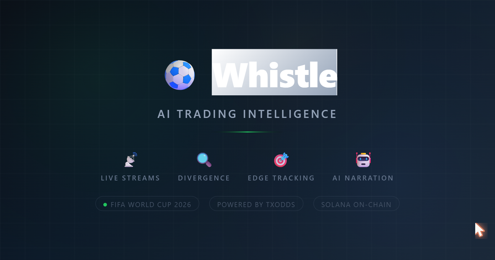

<p align="center">
  
</p>

<h3 align="center">Real-time divergence detection between odds and match events</h3>

<p align="center">
  Built for the <a href="https://txline.txodds.com/documentation/legal/hackathon-terms">TxODDS World Cup Hackathon</a> — Track 2: Trading Tools & Agents
</p>

<p align="center">
  
  
  
  
</p>

---

## The Problem

During a live match, odds and events should move together. A goal should instantly shorten the winning team's odds. A red card should shift the market. But they don't always — and that gap is where the edge lives.

**Whistle watches both streams simultaneously and alerts you the moment they diverge.**

## How It Works

Whistle connects to two TxODDS SSE streams in parallel — one for live odds (per-bookmaker price updates) and one for match events (goals, cards, possession, VAR). A cross-correlation engine detects when these streams disagree, scores the signal's confidence, and delivers an AI-narrated alert to your Telegram within seconds.

```
TxODDS Live Data
    |
    +-- Odds SSE ──> OddsTracker ──> velocity, spread, collapse
    |                                        |
    +-- Scores SSE ─> EventTracker ─> goals, cards, pressure
                                             |
                      DivergenceDetector <───+
                      (cross-correlates both streams)
                              |
                      AI Narrator (LLaMA 3.3 70B)
                              |
                      Telegram Bot ──> subscribers
```

Every alert includes:
- **Confidence score** (0-95%) based on bookmaker count, velocity, delay, or danger sequences
- **Per-bookmaker odds snapshot** with directional arrows (↑↓→)
- **Edge verification** — tracks whether the alert was confirmed by subsequent market movement

## Divergence Patterns

| Pattern | Trigger | Severity |
|---------|---------|----------|
| **Silent Odds Shift** | 3+ bookmakers move odds >5% with no match event in the last 2 min | Critical/High |
| **Odds Collapse** | Price crashes from >1.50 to <1.20 — outcome near-certain | Critical |
| **Delayed Market Reaction** | Goal/red card/penalty fires but odds don't adjust within 10s | High |
| **Momentum Mispricing** | 3+ consecutive danger possessions but odds haven't shortened | Medium |
| **Goal Imminent** | TxODDS flags imminent goal but over/BTTS hasn't tightened | Medium |
| **Bookmaker Disagreement** | 20%+ spread across 3+ bookmakers on the same outcome | Low |

Plus instant event alerts for goals, red cards, penalties, VAR reviews, and phase changes (kickoff, half time, full time, extra time, penalties).

## Example Alert

```
🔴 Silent Odds Shift [87% confidence]

Match Result 1X2 — "Draw" is being backed heavily
across 4 bookmakers with no visible event on the
pitch. Market is pricing something the broadcast
isn't showing.

📊 Odds snapshot:
  Bet365    2.80 → 2.15 ↓
  Pinnacle  2.75 → 2.20 ↓
  William Hill 2.90 → 2.25 ↓
  Betfair   2.85 → 2.30 ↓
```

## Tech Stack

| Layer | Technology |
|-------|-----------|
| Runtime | Node.js + TypeScript |
| Data | TxODDS TxLINE API — dual SSE streams (odds + scores) |
| AI | LLaMA 3.3 70B via OpenRouter |
| Bot | Grammy (Telegram) — 14 commands, inline keyboards |
| Blockchain | Solana (devnet) — Token-2022 on-chain subscription via Anchor |
| Deployment | Railway |
| Storage | JSON file persistence |

## Telegram Commands

| Command | Description |
|---------|-------------|
| `/start` | Welcome banner and overview |
| `/watch` | Pick a live match to monitor |
| `/watchall` | Watch all matches at once |
| `/unwatch` | Stop watching (inline buttons) |
| `/unwatchall` | Stop all monitoring |
| `/live` | Your watched matches with live scores |
| `/alerts` | Recent divergence alerts |
| `/briefing` | Pre-match market overview with consensus odds |
| `/predict` | AI match prediction using live market data |
| `/history` | Alert timeline for a specific match |
| `/settings` | Configure minimum alert severity (low/medium/high/critical) |
| `/stats` | Alert breakdown + edge tracker accuracy |
| `/status` | Stream health, Solana status, AI availability |
| `/help` | Full guide to all 6 divergence patterns |

## Quick Start

```bash
# Install
npm install

# Setup (Solana wallet, on-chain subscription, TxODDS API token)
npm run setup

# Build and run
npm run build && npm start
```

### Environment Variables

```
TELEGRAM_BOT_TOKEN=       # From @BotFather
OPENROUTER_API_KEY=       # From openrouter.ai (free tier works)
TXODDS_JWT=               # Auto-set by setup script
TXODDS_API_TOKEN=         # Auto-set by setup script
SOLANA_PRIVATE_KEY=       # Auto-generated by setup script
SOLANA_RPC_URL=https://api.devnet.solana.com
```

The setup script handles everything: generates a Solana keypair, authenticates with TxODDS, subscribes on-chain (free World Cup tier), activates the API token, and saves credentials to `.env`.

## Under the Hood

### Divergence Engine

1. **OddsTracker** — processes each bookmaker's price update, calculates 60s velocity windows, cross-bookmaker spread, and collapse detection
2. **EventTracker** — processes score events into danger sequences, phase transitions, and match state
3. **DivergenceDetector** — cross-correlates both signal streams within a 2-minute window to flag mismatches
4. **Edge Tracker** — verifies alerts against subsequent market movement (15s-120s) and reports accuracy %
5. **Cooldowns** — severity-based per fixture+type+market (critical: 60s, high: 120s, medium/low: 180s) to prevent alert spam

### Stream Lifecycle

- Streams auto-reconnect with exponential backoff (3s → 60s max)
- JWT expiry (401) stops reconnection and surfaces the error
- Full Time events auto-stop per-fixture streams, unwatch all subscribers, and clean up tracker memory after 60s
- Graceful shutdown (SIGTERM) cancels all SSE readers before exit

### Delivery

- Parallel delivery via `Promise.allSettled` — one blocked user doesn't delay others
- Blocked bot detection (Telegram 403) auto-removes the user's watch
- AI narration with shared rate limiter across alerts and predictions

## Project Structure

```
src/
  index.ts                 # Entry point — stream wiring, delivery, lifecycle
  setup.ts                 # On-chain subscription setup
  bot/
    bot.ts                 # Grammy bot creation + error handler
    commands.ts            # 14 Telegram command handlers
    formatters.ts          # Match state formatting
  engine/
    odds-tracker.ts        # Odds velocity, spread, collapse detection
    event-tracker.ts       # Match event processing + danger sequences
    divergence.ts          # Cross-correlation engine + edge verification
    narrator.ts            # AI alert narration (OpenRouter)
  txodds/
    client.ts              # REST API client (fixtures)
    auth.ts                # JWT + API token authentication
    constants.ts           # API endpoints
    types.ts               # TypeScript interfaces + StoppableEmitter
    odds-stream.ts         # SSE odds consumer with reconnect
    scores-stream.ts       # SSE scores consumer with reconnect
  db/
    schema.ts              # JSON file storage with debounced writes
    queries.ts             # Data access layer
  utils/
    config.ts              # Environment config
    logger.ts              # Structured logger (stdout/stderr)
```

## License

MIT
